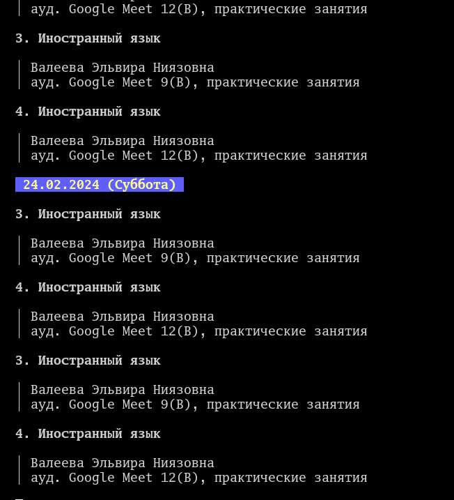

# Schedule parser example

### background...
There are, in our country some cool term to describe shitty, irresponsible educational instituion - "sharaga", pronounced as shah-rah-gah with a stress on a second syllable. Every proud male citizen of urusia upon reaching age of 18 goes there, if he's not want to fall into the hands of evil, into the hands of army.
And for such, even for such bad, as i think, thing, would be better to write schedule parser, what parses schedule of a our sharaga and pretty-prints it.

---
For now code is broken, i saved this here just not to forget my cool idea.
